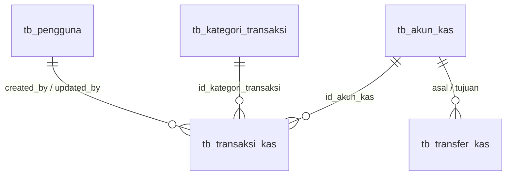

# Desain Database — ERP TKAB

Sumber kebenaran untuk seluruh skema. Perubahan skema harus disetujui pemilik proyek dan dicatat di sini **sebelum** migration dibuat.

## Konvensi Umum

- Tabel domain: `tb_<entitas>` (tunggal). PK: `id_<entitas>` BIGINT UNSIGNED AUTO_INCREMENT (`$table->id('id_<entitas>')`).
- FK bernama sama dengan PK rujukan. Bila ada dua FK ke tabel yang sama, beri akhiran: `id_akun_kas_asal`, `id_akun_kas_tujuan`.
- Setiap tabel domain memiliki `created_at`, `updated_at`, `deleted_at` (soft delete).
- Boolean berawalan `status_` (mis. `status_baca`, `status_aktif`).
- Nilai pilihan tetap: `VARCHAR(20)` + PHP backed enum (bukan tipe ENUM MySQL, agar mudah ditambah).
- Uang: `DECIMAL(15,2)`, tidak pernah FLOAT/DOUBLE.
- File: `VARCHAR(255)` berisi path relatif terhadap disk penyimpanan.
- Unique pada tabel ber-soft-delete divalidasi di Form Request dengan `->withoutTrashed()`; constraint UNIQUE di database hanya untuk kolom yang tidak boleh berulang sama sekali (mis. `nomor_transaksi`).
- Kolom bertanda **(+)** adalah tambahan di luar rancangan awal yang **sudah disetujui** pemilik proyek.

---

## A. Autentikasi

### tb_pengguna
| Kolom | Tipe | Keterangan |
|---|---|---|
| id_pengguna | BIGINT UNSIGNED PK | |
| nama | VARCHAR(100) | |
| email | VARCHAR(150) UNIQUE | |
| password | VARCHAR(255) | cast `hashed` |
| created_at, updated_at, deleted_at | TIMESTAMP NULL | |

Catatan implementasi:
- Model `App\Models\Pengguna extends Authenticatable`. Set `AUTH_MODEL` / `config/auth.php` ke model ini.
- Hapus `App\Models\User` dan definisi tabel `users` dari migration bawaan; **pertahankan** `password_reset_tokens` dan `sessions` dari migration tersebut.
- **Tidak ada kolom `remember_token`** (keputusan pemilik proyek). Konsekuensinya:
  - Model `Pengguna` wajib berisi `protected $rememberTokenName = '';` agar Laravel tidak pernah membaca/menulis kolom tersebut (termasuk saat logout dan reset password).
  - Tidak ada fitur "ingat saya" di halaman login; panggil `Auth::attempt($kredensial)` tanpa argumen kedua.

---

## B. Company Profile

### tb_identitas (singleton — selalu 1 baris, dibuat oleh seeder)
| Kolom | Tipe | Keterangan |
|---|---|---|
| id_identitas | BIGINT UNSIGNED PK | |
| nama_perusahaan | VARCHAR(150) | |
| judul_website | VARCHAR(150) | |
| alamat_website | VARCHAR(255) | URL |
| meta_deskripsi | VARCHAR(255) NULL | |
| meta_keyword | VARCHAR(255) NULL | |
| logo_website | VARCHAR(255) | path file |
| favicon_website | VARCHAR(255) | path file |
| email | VARCHAR(150) | |
| telepon | VARCHAR(30) | |
| alamat | TEXT | |
| link_gmap | TEXT NULL | URL embed Google Maps (bisa panjang) |
| link_youtube | VARCHAR(255) NULL | |
| link_instagram | VARCHAR(255) NULL | dikoreksi dari `link_instragram` |
| link_whatsapp | VARCHAR(255) NULL | |
| created_at, updated_at, deleted_at | | |

### tb_hero
| Kolom | Tipe | Keterangan |
|---|---|---|
| id_hero | BIGINT UNSIGNED PK | |
| judul | VARCHAR(200) | |
| deskripsi | TEXT | |
| gambar | VARCHAR(255) | |
| keyword | JSON | array string, mis. `["Website","Mobile Apps","Pelatihan IT","Sertifikasi IT","Bootcamp"]`; cast `array` |
| cta | JSON | array objek, mis. `[{"label":"Hubungi Kami","url":"#kontak","gaya":"primary"},{"label":"Lihat Portofolio","url":"/portofolio","gaya":"secondary"}]`; cast `array` |
| status_aktif | BOOLEAN DEFAULT true | **(+)** menentukan hero yang tampil di frontend |
| created_at, updated_at, deleted_at | | |

Validasi: `keyword` array max 10, `keyword.*` string max 50; `cta` array max 3, `cta.*.label` wajib max 30, `cta.*.url` wajib max 255, `cta.*.gaya` in:primary,secondary. Form memakai input repeater (tambah/hapus baris).

### tb_layanan
| Kolom | Tipe | Keterangan |
|---|---|---|
| id_layanan | BIGINT UNSIGNED PK | |
| judul | VARCHAR(150) | |
| deskripsi | TEXT | |
| gambar | VARCHAR(255) | |
| keterangan | TEXT NULL | |
| urutan_ke | UNSIGNED SMALLINT DEFAULT 0 | INDEX |
| created_at, updated_at, deleted_at | | |

### tb_portofolio
| Kolom | Tipe | Keterangan |
|---|---|---|
| id_portofolio | BIGINT UNSIGNED PK | |
| judul | VARCHAR(200) | |
| slug | VARCHAR(220) | **(+)** URL detail di frontend |
| deskripsi | TEXT | |
| gambar | VARCHAR(255) | |
| kategori | VARCHAR(50) | INDEX. Sementara teks bebas (mis. Website, Mobile Apps). Dinormalisasi ke tabel sendiri bila dibutuhkan |
| created_at, updated_at, deleted_at | | |

### tb_kategori_artikel
| Kolom | Tipe | Keterangan |
|---|---|---|
| id_kategori_artikel | BIGINT UNSIGNED PK | |
| nama_kategori | VARCHAR(100) | |
| created_at, updated_at, deleted_at | | |

### tb_artikel
| Kolom | Tipe | Keterangan |
|---|---|---|
| id_artikel | BIGINT UNSIGNED PK | |
| id_kategori_artikel | BIGINT UNSIGNED FK → tb_kategori_artikel | `restrictOnDelete` |
| judul | VARCHAR(200) | |
| slug | VARCHAR(220) | **(+)** URL artikel, dibuat otomatis dari judul |
| deskripsi | LONGTEXT | isi artikel (HTML tersanitasi) |
| gambar | VARCHAR(255) | |
| tanggal | DATE | INDEX |
| status_publikasi | VARCHAR(20) DEFAULT 'draf' | **(+)** enum `StatusPublikasi`: draf, terbit |
| created_at, updated_at, deleted_at | | |

### tb_faq
| Kolom | Tipe | Keterangan |
|---|---|---|
| id_faq | BIGINT UNSIGNED PK | |
| pertanyaan | VARCHAR(255) | |
| jawaban | TEXT | |
| urutan | UNSIGNED SMALLINT DEFAULT 0 | INDEX |
| created_at, updated_at, deleted_at | | |

### tb_kontak_kami
| Kolom | Tipe | Keterangan |
|---|---|---|
| id_kontak_kami | BIGINT UNSIGNED PK | |
| nama | VARCHAR(100) | |
| email | VARCHAR(150) | |
| subjek | VARCHAR(200) | |
| pesan | TEXT | |
| tanggal | DATETIME | |
| status_baca | BOOLEAN DEFAULT false | INDEX. Dikoreksi dari `status-baca` |
| created_at, updated_at, deleted_at | | |

Admin hanya: daftar (filter sudah/belum dibaca), lihat (otomatis tandai dibaca), tandai belum dibaca, hapus. Data masuk dari form publik (Fase 5).

---

## C. Kas Perusahaan

### tb_akun_kas — tempat uang disimpan (kas tunai, rekening bank, e-wallet)
| Kolom | Tipe | Keterangan |
|---|---|---|
| id_akun_kas | BIGINT UNSIGNED PK | |
| nama_akun | VARCHAR(100) | mis. "Kas Tunai", "Rekening BCA Operasional". Unik di antara akun yang tidak terhapus (divalidasi di Form Request) |
| jenis_akun | VARCHAR(20) | enum `JenisAkunKas`: tunai, bank, e_wallet |
| nama_bank | VARCHAR(100) NULL | |
| nomor_rekening | VARCHAR(50) NULL | |
| saldo_awal | DECIMAL(15,2) DEFAULT 0 | |
| tanggal_saldo_awal | DATE | |
| status_aktif | BOOLEAN DEFAULT true | akun nonaktif tidak bisa dipilih di transaksi baru |
| keterangan | TEXT NULL | |
| created_at, updated_at, deleted_at | | |

### tb_kategori_transaksi
| Kolom | Tipe | Keterangan |
|---|---|---|
| id_kategori_transaksi | BIGINT UNSIGNED PK | |
| nama_kategori | VARCHAR(100) | unik per `jenis_transaksi` (divalidasi di Form Request) |
| jenis_transaksi | VARCHAR(20) | enum `JenisTransaksi`: pemasukan, pengeluaran. INDEX |
| keterangan | TEXT NULL | |
| created_at, updated_at, deleted_at | | |

Seeder awal (`KategoriTransaksiSeeder`):
- **Pemasukan**: Setoran Modal Pemilik, Jasa Pembuatan Website, Jasa Mobile Apps, Pelatihan IT, Sertifikasi IT, Bootcamp, Pendapatan Lain-lain.
- **Pengeluaran**: Perizinan & Legalitas, Domain & Hosting, Perangkat Lunak & Lisensi, Perangkat Keras, Operasional Kantor, Pemasaran, Honor & Gaji, Transportasi, Pajak, Biaya Administrasi Bank, Pengeluaran Lain-lain.

### tb_transaksi_kas
| Kolom | Tipe | Keterangan |
|---|---|---|
| id_transaksi_kas | BIGINT UNSIGNED PK | |
| nomor_transaksi | VARCHAR(30) UNIQUE | `KM-YYYYMM-0001` (pemasukan) / `KK-YYYYMM-0001` (pengeluaran), dibuat Service; `YYYYMM` = bulan **tanggal transaksi** |
| id_akun_kas | BIGINT UNSIGNED FK → tb_akun_kas | `restrictOnDelete` |
| id_kategori_transaksi | BIGINT UNSIGNED FK → tb_kategori_transaksi | `restrictOnDelete` |
| jenis_transaksi | VARCHAR(20) | enum `JenisTransaksi`; **harus sama** dengan jenis kategori (dijaga Service) |
| tanggal_transaksi | DATE | |
| jumlah | DECIMAL(15,2) | > 0 |
| nama_pihak | VARCHAR(150) NULL | vendor/klien, mis. "Hostinger", "OSS/Notaris" |
| keterangan | TEXT | |
| bukti_transaksi | VARCHAR(255) NULL | path di disk privat `local` |
| referensi_type | VARCHAR(255) NULL | relasi polimorfik ke modul lain (mis. pendaftaran bootcamp) — `nullableMorphs('referensi')` |
| referensi_id | BIGINT UNSIGNED NULL | |
| created_by | BIGINT UNSIGNED NULL FK → tb_pengguna | `nullOnDelete` |
| updated_by | BIGINT UNSIGNED NULL FK → tb_pengguna | `nullOnDelete` |
| created_at, updated_at, deleted_at | | |

Indeks: `(tanggal_transaksi)`, `(id_akun_kas, tanggal_transaksi)`, `(jenis_transaksi, tanggal_transaksi)`.

Aturan bisnis (`App\Services\Kas\TransaksiKasService`):
- Simpan/ubah dalam `DB::transaction()`. Penomoran mengambil nomor terakhir per jenis pada bulan tanggal transaksi (termasuk yang terhapus) dengan `lockForUpdate()` agar tidak bentrok. Bila tanggal diubah ke bulan lain, transaksi mendapat nomor baru di bulan tersebut.
- `jenis_transaksi` tidak diisi dari form, melainkan diambil dari jenis kategori. Saat diubah, kategori hanya boleh diganti dengan kategori berjenis sama (awalan nomor KM/KK tetap cocok).
- Tanggal transaksi tidak boleh melewati hari ini dan tidak boleh sebelum `tanggal_saldo_awal` akun. Transaksi baru hanya memakai akun aktif; saat diubah, akun milik transaksi tetap boleh walau kini nonaktif.
- Bukti transaksi disimpan di disk `local` folder `kas/bukti/` (nama UUID). Saat diganti/dihapus lewat form, berkas lama dibuang setelah perubahan tersimpan; saat transaksi dihapus (soft delete) berkas tetap disimpan.
- Akun kas atau kategori transaksi yang sudah punya transaksi **tidak bisa dihapus**, dan `jenis_transaksi` kategori yang sudah dipakai **tidak bisa diubah** (agar laporan lama tetap konsisten).
- Saldo **tidak disimpan**; dihitung `App\Services\Kas\SaldoKasService` di MySQL (tetap DECIMAL): `saldo_awal + Σ pemasukan − Σ pengeluaran (+ transfer masuk − transfer keluar)` untuk transaksi yang tidak terhapus. Saldo per tanggal menganggap akun bernilai 0 sebelum `tanggal_saldo_awal`. Laporan arus kas (`LaporanKasService`) memisahkan saldo awal akun yang dibuka di dalam periode agar saldo awal + mutasi = saldo akhir.
- Saat relasi polimorfik mulai dipakai, daftarkan alias stabil dengan `Relation::enforceMorphMap()` di `AppServiceProvider` (jangan menyimpan nama class penuh).

### tb_transfer_kas — (direncanakan, Fase 3d) pemindahan dana antar akun
| Kolom | Tipe | Keterangan |
|---|---|---|
| id_transfer_kas | BIGINT UNSIGNED PK | |
| nomor_transfer | VARCHAR(30) UNIQUE | `TF-YYYYMM-0001` |
| id_akun_kas_asal | BIGINT UNSIGNED FK → tb_akun_kas | |
| id_akun_kas_tujuan | BIGINT UNSIGNED FK → tb_akun_kas | harus berbeda dari asal |
| tanggal_transfer | DATE | |
| jumlah | DECIMAL(15,2) | > 0 |
| keterangan | TEXT NULL | |
| created_by, updated_by | BIGINT UNSIGNED NULL FK → tb_pengguna | |
| created_at, updated_at, deleted_at | | |

Transfer bukan pemasukan/pengeluaran perusahaan, sehingga tidak masuk laporan laba/arus kas per kategori, hanya memengaruhi saldo per akun. Biaya admin transfer dicatat sebagai transaksi pengeluaran terpisah.

---

## D. Modul Masa Depan (gambaran, belum dibuat)

Untuk memastikan desain hari ini kompatibel:
- `tb_peserta` — data orang (mahasiswa/peserta) yang dipakai bersama oleh pelatihan, sertifikasi, dan bootcamp.
- `tb_pelatihan`, `tb_sertifikasi`, `tb_bootcamp` — master program/batch.
- `tb_pendaftaran_*` — relasi peserta ↔ program, status, nilai, sertifikat.
- Pembayaran pendaftaran → `tb_transaksi_kas` dengan `referensi_type`/`referensi_id` menunjuk pendaftaran terkait.
- `tb_klien`, `tb_proyek`, `tb_invoice` — untuk jasa website & mobile apps.
